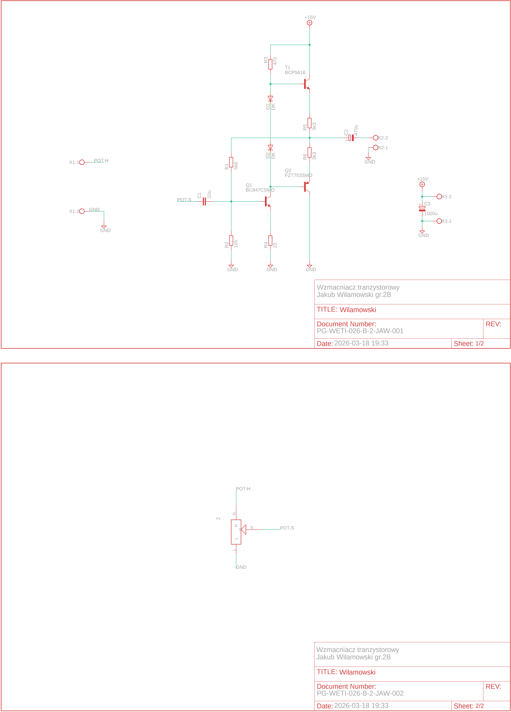
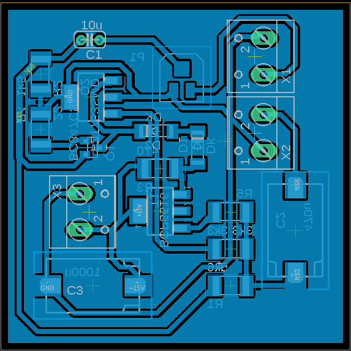
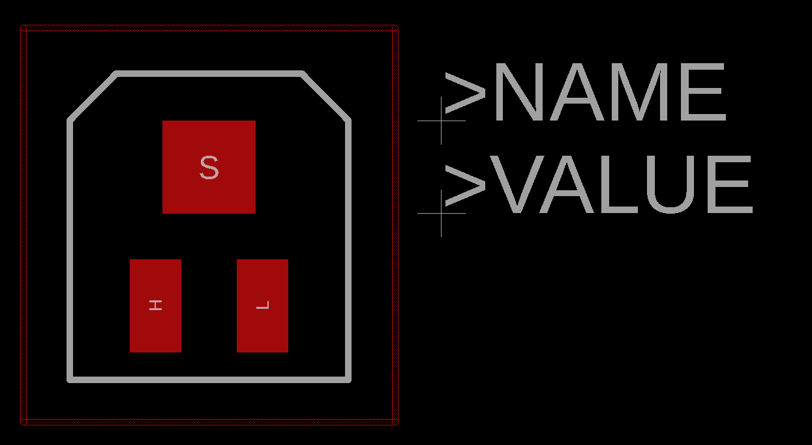
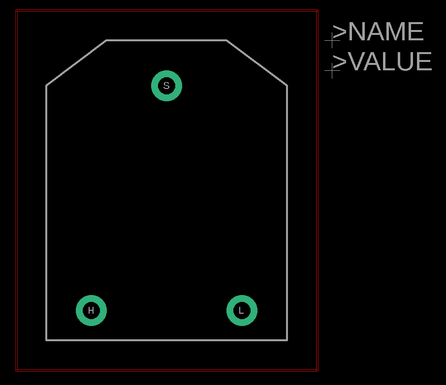
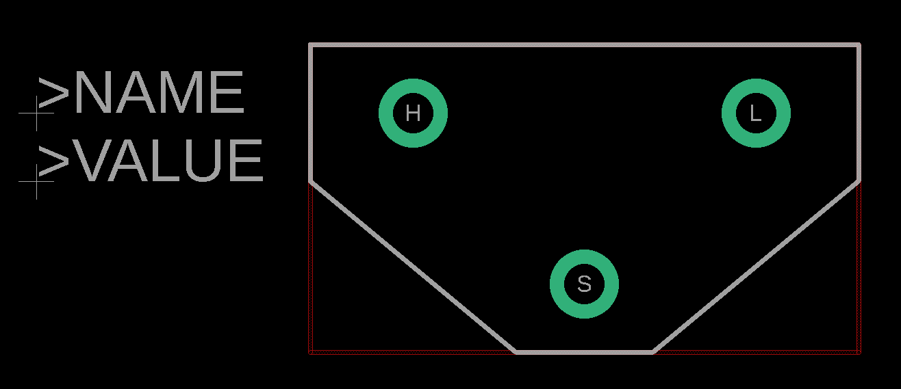

# Wzmacniacz tranzystorowy

## Schemat ideowy układu

## Schemat skończonej płytki

## Schematy obudów z własnej biblioteki
| 1804(3314) | CN 15.1 | CN 15.2 |
| :---: | :---: | :---: |
|  |  |  |

## Wykorzystane narzędzia
* Autodesk Eagle 9.6.2
* Własna biblioteka komponentów (folder /libs)